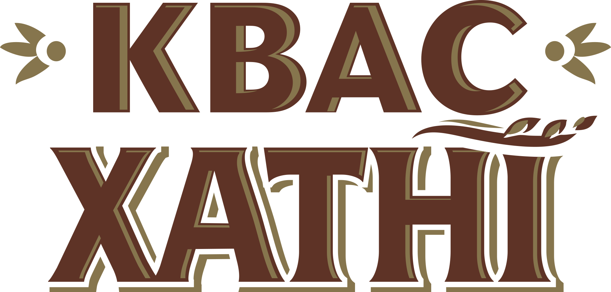
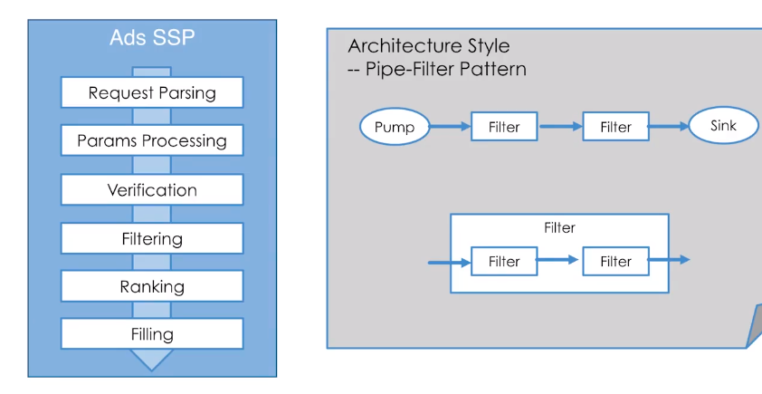

# kvass

Kvass 微爬虫框架    基于Pipe-filter pattern设计模式 

说是框架又不是框架 是一个整合体

### 运行
下载kvass 放入GOPATH bin下  

运行kvass 命令
- `--help` 查看帮助
- `-p`     指定包名 (如果非go mod 可以默认 系统会自己查询)

注： 首次运行不用填写命令  (首次运行会生成配置文件,先填写配置文件然后在 运行命令)